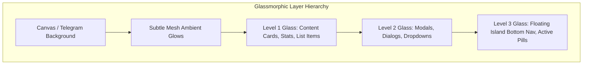
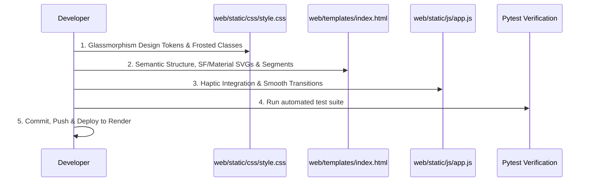

# 💎 Glassmorphism & Expressive UI/UX Redesign Plan for Telegram Mini App

## Goal Description
Ushbu rejaning maqsadi — **Telegram Mini App (TWA)** interfeysini mavjud sodda / multi-filmga o'xshash dizayndan **Google Material You (Expressive / Frosted Glass)** va **Apple iOS Vibrancy (Ultra-Thin Backdrop Blur / Glassmorphism)** standartlariga mos, yuqori sifatli (High-End / Flagship) professional dizayn tizimiga to'liq o'tkazish.

Yangi dizayn foydalanuvchiga Android 14/15/16 (One UI 6/7, HyperOS) hamda iOS 17/18 tizimlaridagi kabi estetik, real-vaqtdagi shishasimon xiralashtirish (`backdrop-filter: blur()`), silliq mikro-interaksiyalar, yorug'lik chegaralari (specular highlights) va kristaldek toza tipografiyani taqdim etadi.

---

## 🎨 Dizayn Tizimi va Standartlar (Design System Spec)



### 1. Shishasimon (Glassmorphism) Qatlamlar Spetsifikatsiyasi
* **Level 1 (Karta va Ro'yxatlar)**: 
  * `background: rgba(255, 255, 255, 0.05);` (Dark) / `rgba(255, 255, 255, 0.65);` (Light)
  * `backdrop-filter: blur(20px) saturate(180%);`
  * `border: 1px solid rgba(255, 255, 255, 0.12);`
  * `box-shadow: inset 0 1px 0 0 rgba(255, 255, 255, 0.15), 0 8px 24px -4px rgba(0, 0, 0, 0.3);`
* **Level 2 (Modallar va Tahrirlash Oynalari)**:
  * `background: rgba(18, 24, 38, 0.82);` (Dark) / `rgba(255, 255, 255, 0.88);` (Light)
  * `backdrop-filter: blur(32px) saturate(200%);`
  * `border: 1px solid rgba(255, 255, 255, 0.16);`
* **Level 3 (Suzuvchi Pastki Navigatsiya — Floating Island Dock)**:
  * `background: rgba(15, 23, 42, 0.72);` (Dark) / `rgba(255, 255, 255, 0.82);` (Light)
  * `backdrop-filter: blur(28px) saturate(190%);`
  * `border: 1px solid rgba(255, 255, 255, 0.14);`
  * `border-radius: 9999px;` (Pill dock)

### 2. Tipografiya va Ranglar Palitrasi
* **Shriftlar**: Apple SF Pro Display / Google Roboto / Inter / System UI stack (`-apple-system, BlinkMacSystemFont, "SF Pro Text", "Segoe UI", Roboto, sans-serif`).
* **Harflar oralig'i (Tracking)**: Sarlavhalar uchun `-0.025em`, asosiy matn uchun `-0.01em`, kichik teglar uchun `+0.02em`.
* **Ranglar**:
  * Asosiy aksent: Google Material Electric Blue (`#38bdf8` / `#2563eb`)
  * Qo'shimcha aksentlar: iOS Indigo (`#6366f1`), Emerald (`#10b981`), Rose (`#f43f5e`), Amber (`#f59e0b`)
  * Matn: Crisp White (`#f8fafc`), Subtitle (`#cbd5e1`), Translucent Muted (`#94a3b8`)

---

## 🛠 Rejalashtirilgan O'zgarishlar (Proposed Changes)

### 1. `web/static/css/style.css` — To'liq Qayta Ishlab Chiqish [MODIFY]
* ❌ Eski neon gradientlar, bolalarcha animatsiyalar va qattiq chegaralarni to'liq olib tashlash.
* ✅ Haqiqiy **Backdrop Blur + Saturation** asosidagi shishasimon CSS tokenlar tizimi.
* ✅ Material 3 / iOS uslubidagi squircle kartalar (`border-radius: 20px`).
* ✅ **Floating Island Bottom Bar**: Pastki navigatsiyani zamonaviy suzuvchi kapsula (pill) shakliga keltirish, bosilganda haptic-scale effekti.
* ✅ **Input & Formlar**: Zamonaviy shaffof maydonlar, silliq fokus halqalari, yagona padding va masofalar.
* ✅ **Skeleton Shimmer**: Qotib qoluvchi spinnerlar o'rniga zamonaviy shishasimon skeleton yuklanish animatsiyasi.
* ✅ **Modallar**: Apple iOS Sheet uslubidagi silliq modal oynalar va blur overlay.

### 2. `web/templates/index.html` — Vizual Struktura va Ikonkalar Yangilanishi [MODIFY]
* ✅ SVG ikonkalarini Google Material Symbols / Apple SF Symbols minimalizmiga moslashtirish (toza chiziqlar, stroke-width: 1.75px).
* ✅ Header qismidagi til tanlash panelini iOS Segmented Control uslubidagi shishasimon tugmalarga aylantirish.
* ✅ Hero Countdown kartasini premium ko'rinishga keltirish (radial blur orqa fon, kutilayotgan kunlar hisoblagichi).
* ✅ Ro'yxat elementlari, sovg'a generatori va AI tabrik qismini shaffof toza kartalarga ajratish.

### 3. `web/static/js/app.js` — UI Interaktivligi va Render Hardening [MODIFY]
* ✅ Haptic feedback: Telegram WebApp `tg.HapticFeedback.impactOccurred('light')` qo'llab-quvvatlovi qo'shiladi (tugmalar bosilganda va tab o'zgarganda xuddi iOS/Android ilovadek seziladi).
* ✅ Modal ochilish/yopilishida silliq CSS klasslar boshqaruvi.
* ✅ Mavjud barcha API va DOM ID'lar 100% o'z joyida saqlanadi (backend bilan bog'lanish buzilmaydi).

---

## 📋 Bosqichma-bosqich Bajarish Rejasi



1. **1-qadam (CSS)**: `web/static/css/style.css` faylida Glassmorphism dizayn tizimini to'liq yangilash (Variables, Base, Cards, Navigation, Inputs, Modals, Skeleton, Animations).
2. **2-qadam (HTML)**: `web/templates/index.html` faylida semantika, toza vektorlar, badge va segmented controllarni joylashtirish.
3. **3-qadam (JS)**: `web/static/js/app.js` da Telegram haptic feedback va vizual tozalikni mustahkamlash.
4. **4-qadam (Test & Tekshiruv)**: Avtomatlashtirilgan testlar va sintaksis tekshiruvini yurgizish.
5. **5-qadam (Deploy)**: O'zgarishlarni GitHub `main` branchiga yuklash va Render'da `live` statusga chiqarish.

---

## 🔍 Tekshirish Rejasi (Verification Plan)

### Avtomatlashtirilgan Testlar
```bash
./venv/bin/pytest -v
```
Barcha 24 ta test 100% muvaffaqiyatli o'tishi shart.

### Vizual va Qo'lda Tekshirish
1. **Glassmorphism Backdrop Blur**: Orqa fondagi ambient yorug'lik va kartalar ostidagi elementlar xiralashib (blur) ko'rinishi.
2. **Floating Bottom Dock**: Pastki navigatsiya barchasi to'g'ri o'tishi va active indikator ishlashi.
3. **Modal & Dialogs**: Tahrirlash, o'chirish va Zodiak modallari shaffof oynali ko'rinishda silliq ochilishi.
4. **Dark & Light Mode**: Telegramning qorong'i va yorug' rejimlarida kontrast va shaffoflikning mukammal ko'rinishi.
